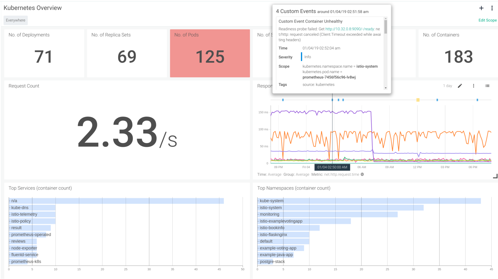

Sysdig Monitor is tightly integrated with Kubernetes events and [kube-state-metrics](https://github.com/kubernetes/kube-state-metrics).

You can start gathering information about this error directly from the Events tab in the Sysdig Monitor interface:

We can see there is a crashloop event for the `kubernetes.pod.name='nginx-86595b9b4b-khg8q'` and the exact time for this event.

We can directly use the button `Create alert from event` at the bottom to generate an alert item every time this event or a similar event is triggered.

Most of the fields from this alert will auto-fill based on the actual event that happened in your Kubernetes cluster.

Now that we have configured an alert, we can also correlate these events with the behavior of our systems. Looking at the image below we can quickly see when a specific backoff event occurred and if it caused and change to the performance of the system.

Proposed exercise: Kube-state-metrics
-------------------------------------

Sysdig collects the kube-state-metrics out of the box, these metrics will provide full insight regarding the state of your Kubernetes cluster, for example:

- How many instances we are running? How many we want?
- Are the pods running, available and ready?
- Which entities compose my namespace? Are they up and running?

Go back to the explore tab, select the `nginx-flask` namespace and iterate over all the `Kubernetes` → `Kubernetes State` dashboards.

- Would you be able to diagnose errors in the deployment looking at this panels?
- Which are the most relevant for the application we are trying to deploy in this exercise?
