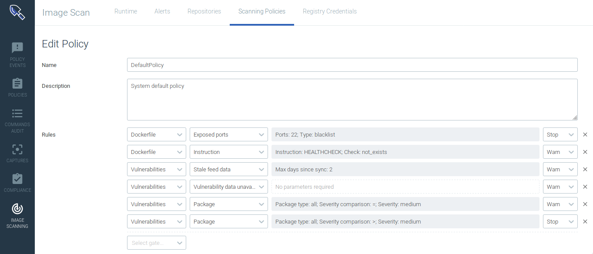

Sysdig Secure allows you to configure different policies for image scanning, so you can create custom behaviour with different rules.

For this Lab, Sysdig Secure must be configured with the following minimum settings:

Gate            | Kind          | Description                                                 | Action
----------------|---------------|-------------------------------------------------------------|-------
Dockerfile      | Exposed ports | Ports: 22, Type: blacklist                                  | Stop
Dockerfile      | Instruction   | HEALTHCHECK not exists                                      | Warn
Vulnerabilities | Package       | Package type: all; Severity comparison: =; Severity: medium | Warn
Vulnerabilities | Package       | Package type: all; Severity comparison: >; Severity: medium | Stop

Let's explain this settings:

* You can define the ports exposed from an image and port 22 is a special one which is commonly used for SSH connections. We don’t want SSH connections to our containers, because that can compromise the security of the internal cluster.
* HEALTHCHECK is a special instruction when a Docker image is built, which tells Docker how to test a container to check that it is still working. This can detect cases such as a web server that is stuck in an infinite loop and unable to handle new connections, even though the server process is still running.
* Vulnerabilities in the package with a severity comparison equals to medium: when the image is scanned, Anchore measures the severity of the vulnerabilities that detects, if the ones that it finds are equal to “medium”, then we will just report a Warning.
* When Anchore scans the image and detects vulnerabilities higher than severity medium, we report that we must stop the execution of the pipeline.

Anchore Gates
-------------

<table>
    <thead>
      <tr>
        <th>Gate</th>
        <th>Kind</th>
        <th>Description</th>
      </tr>
    </thead>
    <tbody>
    <tr>
        <td>Always</td>
        <td>Always</td>
        <td>Always perform the desired action (Warn or Stop)</td>
    </tr>
    <tr>
        <td rowspan="4">Dockerfile</td>
        <td>Instruction</td>
        <td>Checks if the instruction while building the image exists or contains some value.</td>
    </tr>
    <tr>
        <td>Effective user</td>
        <td>Allows to whitelist or blacklist the users defined by the USER instruction.</td>
    </tr>
    <tr>
        <td>Exposed ports</td>
        <td>Checks if some ports have been exposed.</td>
    </tr>
    <tr>
        <td>No Dockerfile provided</td>
        <td>Checks if the Dockerfile was not provided.</td>
    </tr>
    <tr>
        <td rowspan="3">Files</td>
        <td>Content regex match</td>
        <td>Allows to check if some file contents match some provided regex.</td>
    </tr>
    <tr>
        <td>Name match</td>
        <td>Finds if some file matches any provided regex.</td>
    </tr>
    <tr>
        <td>Suid or Guid set</td>
        <td>
            Checks if some file has set the flag <a
                href="https://www.google.com/url?q=https://en.wikipedia.org/wiki/Setuid%23SUID&amp;sa=D&amp;ust=1556128396119000"
                >Suid</a
            >
            or
            <a
                href="https://www.google.com/url?q=https://en.wikipedia.org/wiki/Setuid%23SGID&amp;sa=D&amp;ust=1556128396120000"
                >Guid</a
            >.
        </td>
    </tr>
    <tr>
        <td rowspan="2">Licenses</td>
        <td>Blacklist exact match</td>
        <td>
            If it finds some package with a license that matches with the provided version, applies
            the desired action.
        </td>
    </tr>
    <tr>
        <td>Blacklist partial match</td>
        <td>
            If it finds some package with a license that matches with any of its versions, applies
            the desired action.
        </td>
    </tr>
    <tr>
        <td>Metadata</td>
        <td>Attribute</td>
        <td>
            Allows to check attributes from the created image, like operating system base, layer
            count, size, architecture...
        </td>
    </tr>
    <tr>
        <td rowspan="4">Npms</td>
        <td>Newer version in feed</td>
        <td>
            Checks out if there is some NPM library that has a newer version in the remote
            repositories, and thus can be updated.
        </td>
    </tr>
    <tr>
        <td>Version not in feeds</td>
        <td>
            If the installed version of the package is not found in the remote repositories,
            executes the desired action.
        </td>
    </tr>
    <tr>
        <td>Blacklisted name version</td>
        <td>
            One can blacklist a specific version from a package, so when it is detected, the
            scan reports the desired action.
        </td>
    </tr>
    <tr>
        <td>Feed data unavailable</td>
        <td>Triggered when Anchore can't retrieve data from the remote repositories.</td>
    </tr>
    <tr>
        <td rowspan="3">Packages</td>
        <td>Required package</td>
        <td>Checks if the desired package is installed in the image with an optional version.</td>
    </tr>
    <tr>
        <td>Verify</td>
        <td>Checks if the package or a subdirectory tree has changed or is missing.</td>
    </tr>
    <tr>
        <td>Blacklist</td>
        <td>
            Check if the desired package is not installed in the image with an optional version.
        </td>
    </tr>
    <tr>
        <td rowspan="6">Passwd file</td>
        <td>Content not available</td>
        <td>The contents of the /etc/passwd file can't be retrieved.</td>
    </tr>
    <tr>
        <td>Blacklist usernames</td>
        <td>Checks the file and triggers the action if it finds a user by its name.</td>
    </tr>
    <tr>
        <td>Blacklist userids</td>
        <td>Checks the file and triggers the action if it finds a user by its id.</td>
    </tr>
    <tr>
        <td>Blacklist groupids</td>
        <td>Checks the file and triggers the action if it finds a group by its id.</td>
    </tr>
    <tr>
        <td>Blacklist shells</td>
        <td>Checks the file and triggers the action if it finds a shell by its name.</td>
    </tr>
    <tr>
        <td>Blacklist full entry</td>
        <td>Checks the file and triggers the action if it finds the provided entry.</td>
    </tr>
    <tr>
        <td rowspan="5">Ruby gems</td>
        <td>Newer version found in the feeds</td>
        <td>Checks if there's a newer version in the remote repositories.</td>
    </tr>
    <tr>
        <td>Not found in feed</td>
        <td>Checks if the package was not found in the remote repositories.</td>
    </tr>
    <tr>
        <td>Version not found in feed</td>
        <td>Checks if the package version was not found in the remote repositories.</td>
    </tr>
    <tr>
        <td>Blacklist</td>
        <td>Allows one to blacklist a package with an optional version.</td>
    </tr>
    <tr>
        <td>Feed data unavailable</td>
        <td>Triggered when no data could be retrieved from the remote repositories.</td>
    </tr>
    <tr>
        <td>Secret scans</td>
        <td>Content regex checks</td>
        <td></td>
    </tr>
    <tr>
        <td rowspan="3">Vulnerabilities</td>
        <td>Package</td>
        <td>Checks if some package (OS or non-OS) contains some vulnerability.</td>
    </tr>
    <tr>
        <td>Stale feed data</td>
        <td>Checks if the vulnerability database is older than a period of time.</td>
    </tr>
    <tr>
        <td>Vulnerability data unavailable</td>
        <td>Checks if the vulnerability database can't be updated.</td>
    </tr>
    </tbody>
</table>
